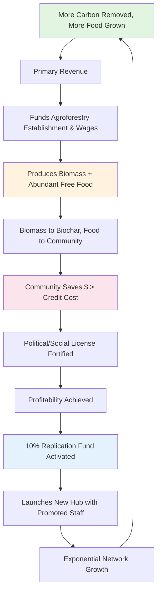

# The Modern Druid Project: A Blueprint for Integrated Climate Repair

[Problem]

[Solution]

[Ask for Collaboration]

---

### **1.0 The Integrated Crisis: Four Interlocking Failures Demanding a Unified Solution**

We are not facing separate environmental, social, and economic challenges. We are witnessing the catastrophic convergence of **four systemic failures** that reinforce each other. Attempting to solve any one in isolation is doomed; only an integrated solution that addresses all four simultaneously can succeed.

#### **1.1 The Carbon Crisis: A One-Way System**
The planet’s carbon cycle has been hijacked by industrial logic. We move carbon from stable geological and biological sinks (fossil fuels, forests, soil) into the active atmosphere and oceans at a rate orders of magnitude faster than natural processes can re-sequester it. **The failure is economic:** the atmosphere is treated as a free, infinite dump. There is no profitable, self-sustaining engine for gigatonne-scale *permanent* drawdown. Current solutions are either too slow (reforestation), too costly (DAC), or too temporary (soil carbon vulnerable to re-release). We have engineered a one-way flow, and now lack the economic machinery to reverse it.

#### **1.2 The Food System Crisis: Abundance as Scarcity**
Paradoxically, our agricultural system—designed to produce abundance—creates scarcity, vulnerability, and degradation. It is a **net carbon source**, reliant on extractive inputs that deplete soil, poison waterways, and collapse biodiversity. To be "economically viable," every calorie must be monetized, embedding massive logistical costs, food waste, and nutritional poverty into the system. The result is a populace both overfed and undernourished, utterly dependent on fragile, globalized supply chains that fail under the climate stresses the system itself exacerbates. We grow more than enough calories to feed humanity, yet hunger persists—a pure failure of distribution and economic design.

#### **1.3 The Inequality Crisis: Concentrated Risk, Distributed Suffering**
The costs and risks of the carbon and food crises are borne disproportionately by the most vulnerable, while the wealth generated from land, resources, and even nascent climate markets flows upward. Land ownership is concentrated. Agricultural and ecological work is undervalued. **The failure is one of value distribution:** the people most critical to planetary stewardship—farmers, foresters, indigenous communities—are systematically excluded from the wealth their labor and knowledge could generate. This stifles innovation, destroys social cohesion, and guarantees resistance to top-down climate policies perceived as unjust. A solution that does not explicitly dismantle this concentration of wealth and power will lack the social license to operate at scale.

#### **1.4 The Scale Crisis: The Gigatonne Chasm**
This is the ultimate, often unspoken failure. We have a **chasm between demonstration and deployment.** Countless pilot projects prove a technology or practice can work on 10 or 100 hectares. Virtually none have a credible, self-financing pathway to **gigatonne-scale impact** (billions of tonnes CO₂ per year)—the level necessary to actually re-stabilize the climate system. Scaling is blocked by:
*   **Capital Dependence:** Reliance on continuous philanthropic or government funding.
*   **Land Access:** Models requiring prime agricultural land compete directly with food production.
*   **Social Friction:** Solutions imposed without local economic benefit face political and community resistance.
*   **Economic Fragility:** Models that cannot achieve unit profitability cannot replicate exponentially.

A solution that cannot cross the **Gigatonne Chasm** is, in the end, a distraction. It may make for a compelling case study, but the planet still burns.

---

### **The Inescapable Conclusion: The Need for an Integrated Engine**

These four crises form a **nexus of failure.** A carbon solution that requires massive land grabs worsens inequality. A food solution that depends on chemical inputs accelerates carbon release. An equitable model that isn't profitable cannot scale. A scalable model that isn't equitable will be torn down.

**Therefore, the only viable solution is an integrated engine designed from first principles to:**
1.  **Generate primary revenue from permanent, verifiable carbon removal.**
2.  **Produce abundant food as a non-monetized public good, breaking the scarcity trap.**
3.  **Constitutionally distribute wealth and ownership to the stewards doing the work.**
4.  **Be inherently profitable and self-replicating, building an exponential pathway to gigatonne-scale impact.**

The following document details the blueprint for that engine: **The Modern Druid Project.**

---

### **2.0 The Core Hypothesis: The Architecture of an Unstoppable Solution**

The climate, food, and inequality crises are locked in a vicious cycle by a single, flawed economic logic: the **extraction of short-term value**. This logic produces three interlocking system failures and one critical barrier:

1.  **The Carbon Problem:** A Failure of Economic Alignment.
2.  **The Food Problem:** A Failure of Abundance Distribution.
3.  **The Inequality Problem:** A Failure of Value Distribution.
4.  **The Scale Problem:** A Failure of Viral Adoption.

**The Modern Druid Hypothesis:**  
We can solve these failures **simultaneously and permanently** by designing a system that achieves **three specific, measurable economic thresholds**—turning it from a proposal into an inevitability.

| System Goal | Core Mechanism | Proof of Impact & Viral Trigger |
| :--- | :--- | :--- |
| **1. Carbon Removal** → **Primary Revenue** | Sell high-integrity, permanent carbon credits (Biochar, ERW, Soil C). | **Funds the entire operation.** Validated by SDG 13, 12, 9. |
| **2. Food Abundance** → **Non-Monetized Commons** | Give all food away via free pick-your-own. | **Eliminates 40%+ of farm OPEX.** Validated by SDG 2, 3, 11. |
| **3. Equitable Ownership** → **Constitutional Stewardship** | 50/30/10/10 profit share; path to land ownership. | **Creates aligned stakeholders.** Validated by SDG 1, 8, 5, 10. |
| **4. Exponential Replication** → **Built-In Growth** | **10% Replication Fund** spawns new farms, led by employee-owners. | **Solves the scale problem.** Validated by SDG 17. |

#### **The Decisive Breakthrough: Economic Inevitability**

The model's true disruptive power emerges when three financial targets are met—targets our design is engineered to hit:

1.  **Food Production Parity:** The system must **match or exceed the retail-calorie value per hectare** of conventional agriculture on the same land. Our stacked agroforestry + remineralization system is designed to do this within 5-7 years.
2.  **Community Cost Savings:** The **free food value** produced must **exceed the total cost of carbon credits** needed to fund the hub. *Example:* If a mature can hub produce ~$1.5M in food and requires ~$700k in credits. The community **nets ~$800k in annual savings.**
3.  **Unit Profitability:** Each hub must generate enough carbon credit and sales revenue to cover sustainable and living wages, inputs, MRV, and both the **10% Global Franchise Fee** and the **10% Replication Fund**.

**When these three targets align, the model becomes politically and economically unstoppable:**

*   **It Justifies Land Use:** "Why use good farmland for carbon?" Because it produces **equal or more food while removing 35+ tonnes of CO₂/ha/yr.**
*   **It Bypasses Political Gridlock:** You don't need policy mandates. You sell a **cost-saving service** to municipalities, corporations, and nations: *"Pay us to remove carbon, and we'll also solve your food security problem for free, saving your budget."*
*   **It Creates Its Own Demand:** A project that **saves money while solving multiple crises** creates a **coalition of the willing** from local families to corporate CFOs to climate ministers. Opposition becomes irrational.

**The Final Hypothesis:**  
This isn't intended to be a charity or a niche carbon project. This is meant to be a **profitable, self-replicating service** that is **cheaper for communities than the status quo.** By aligning carbon finance with food security and local economics, we can transform climate action from a political burden into an irresistible economic opportunity. This is the architecture of a solution that scales **with or without political leadership**, because it is built on the universal language of **abundance, savings, and pragmatic benefit.**

---

### **3.0 The Modern Druid Model: An Integrated Engine for Permanent Solutions**

The Modern Druid Project is not a collection of separate sustainability initiatives. It is a single, engineered system designed from first principles to act as an **integrated solution engine**—turning the four interlocking crises of Carbon, Food, Inequality, and Scale into a self-reinforcing cycle of regeneration.

Each component is necessary and mutually reinforcing. Remove one, and the system fails to achieve its goals of profitability, abundance, justice, and exponential growth.

---

### **3.1 The Carbon Removal Engine: Making Atmosphere Repair Profitable**
**The Core Economic Mechanism**

To solve the **Carbon Crisis**, we must make permanent drawdown more profitable than extraction. We achieve this not with a single method, but with a **stacked, verifiable carbon removal system** that generates the primary revenue for the entire project.

| Pathway | Mechanism & Registry | Annual Removal (Mature 100-ha Hub) | Economic Role |
| :--- | :--- | :--- | :--- |
| **Biochar** | Pyrolysis of on-site biomass → stable carbon. *(Puro.earth)* | ~1,760 t CO₂e | **Primary Revenue Driver.** High-value, durable credits. |
| **Enhanced Rock Weathering (ERW)** | Spreading crushed basalt → mineral carbonation. *(Puro.earth)* | ~1,500 t CO₂e | **Synergistic Multiplier.** Leverages same labour/equipment as biochar application. |
| **Deep Soil Carbon** | Syntropic agroforestry builds stable SOC to 3m depth. *(Verra + CCB)* | ~400 t CO₂e | **Premium Crediting.** Bundled with 12+ SDGs for price premium. |
| **TOTAL** | **Stacked, Permanent Removal** | **~3,660 t CO₂e/yr** | **Funds the entire operation.** |

**Financial Implication:** This stack generates **~$724,000 CAD/year in credit revenue alone** at conservative 2025 prices, before any biochar sales. It provides the dependable income stream that de-risks the entire enterprise and funds wages, inputs, and replication.

---

### **3.2 The Food Abundance Commons: Ending Scarcity by Refusing to Monetize It**
**The Social & Logistical Breakthrough**

To solve the **Food System Crisis**, we must decouple nutrition from commodity logistics. Our radical premise: **All fruit, nuts, berries, and perennial vegetables are free, pick-your-own for the community.**

**How It Works & Why It's Genius:**
1.  **Zero Harvest, Transport, or Sales Costs:** We eliminate ~40% of a conventional farm's operating expenses—the most complex and costly part of the food system.
2.  **Creates Instant, Unassailable Value:** A mature hub produces food with a retail-equivalent value of **$1.5–2.5 million CAD/year**. This value is delivered directly to the community, creating a net economic benefit far greater than the cost of the carbon credits that fund it.
3.  **Builds Political and Social Resilience:** It is politically impossible to oppose a project that feeds families for free while fixing the climate. The community becomes its staunchest defender.
4.  **Enables a Local Value-Add Economy:** While we do not monetize food, we encourage entrepreneurs to use the abundance to start businesses (jams, ciders, baked goods), fostering local economic diversification.

**This is not charity; it is strategic system design.** By giving away the food, we solve distribution, build a massive public good, and slash our own costs, making the carbon venture more profitable and scalable.

---

### **3.3 The Stewardship & Ownership Model: A Time-Bound Vehicle for Land Justice**
**The Governance Backbone (B-Corp from Day One)**

To solve the **Inequality Crisis**, wealth and ownership must be hard-coded into the system's DNA. Modern Druid is not structured as a permanent, land-owning corporation. It is a **time-bound transition vehicle** designed to heal land, distribute wealth, and then transfer ownership to the stewards who did the work.

Our constitutional, B-Corp-ready governance model has a **two-phase profit allocation rule** and a **defined end-state for land ownership**:

**PHASE 1: Pre-Profitability (Years 1–4)**
All revenue is split **50/50** between:
*   **Employee Pool** (Living wages, benefits, bonuses; strict 2:1 max pay ratio).
*   **Local Development Fund** (Covers all ops, inputs, debt, MRV—survival first).

**PHASE 2: Post-Profitability (The Replication & Legacy Engine)**
Once the hub is sustainably funding itself, profits split as follows:

| 50% | **Employee Pool** | Living wages, benefits, performance bonuses. |
| 30% | **Local Development Fund** | Operating costs, debt repayment, buying adjacent land. |
| 10% | **Local Replication Fund** | **Seed capital for the next hub, led by promoted employees.** |
| 10% | **Modern Druid Central Royalty** | Funds global R&D, open-source toolkit, seeds hubs in new climates. |

#### **The Defined Ownership Pathway: From Stewards to Owners**

The Modern Druid Project has a **clear beginning and a clear end** at both the hub and global levels:

*   **Hub-Level End (20–25 Year Horizon):** Aligned with standard carbon crediting periods (e.g., Verra's 20-year vintages), each hub is designed from inception for **eventual transfer to its workforce.** Upon successful completion of its core carbon removal commitment, the land and improved infrastructure are either transferred to a **local trust or cooperative**, with ownership shares allocated to employees **pro-rata based on their tenure and wages earned on that land**, or simply broken up and given out pro rated as before. The trained stewards become the owners of a fertile, productive, climate-resilient asset.

*   **Global-Level End (Mission Completion):** The project as a whole ends when its core objective is met: **when atmospheric CO₂ is safely returned to pre-industrial levels and the climate is re-stabilized.** We are building a network of self-replicating repair engines, not a perpetual corporation. Then we can rest.

**This is the antithesis of economic colonialism.** We do not arrive, extract value, and leave. We arrive, **invest in people and land,** build shared wealth, and then **hand over the keys.** Our success is measured by our eventual obsolescence in a given community, leaving behind a legacy of food sovereignty, carbon-sequestering landscapes, and local, land-owning farmers equipped for the future.

The 10% Replication Fund ensures that as one hub completes its journey to local ownership, the model has already seeded the next one elsewhere, propagating this cycle of repair and transfer not just here, but everywhere, focusing on the underserved climates and less developed nations who cannot afford to start these hubs.

---

### **3.4 The Exponential Replication Engine: Closing the Gigatonne Chasm**
**The Built-In Scale Mechanism**

The **10% Local Replication Fund** is the masterstroke that solves the **Scale Crisis**. It transforms each profitable hub from an endpoint into a **node of exponential growth**. If you want an exponential growth curve, make it self-replicate, same as in biology.

**The Growth Math:**
1.  **Hub 1** becomes profitable and allocates 10% of profits to its Replication Fund.
2.  That fund, combined with promoted employees, launches **Hub 2**.
3.  **Now two hubs** are generating Replication Funds, soon launching **Hubs 3 & 4**.
4.  The process repeats: **1 → 2 → 4 → 8 → 16...**

This is **exponential, asset-based growth**, not linear fundraising. It is powered by the model's own profitability and the ambition of its workforce. Scaling is no longer limited by external capital or political will, but by the rate at which we can train new stewards—a constraint we control.

**Crossing the Gigatonne Chasm:** This replication model, combined with the **universal economic appeal** of cost-saving, food-secure hubs, is designed to achieve viral adoption. We are not asking the world to adopt an austerity program. We are offering a **profitable service** that saves money, feeds people, and creates jobs—a proposition that builds its own coalition of the willing, from municipal governments to corporate boards.

---

### **3.5 The Integrated Flywheel: How the Model Becomes Unstoppable**

The power of Modern Druid is not in any single component, but in their **synergistic integration**, creating a virtuous cycle that locks in success:

This is the architecture of a solution that is **profitable, politically resilient, socially just, and exponentially scalable.** It is designed not just to work, but to be **impossible to stop.**

---

### **4.0 Proof of Concept: The 100-Hectare Canadian Flagship Hub**

The theoretical model must be proven under the most demanding real-world conditions. The first **Modern Druid Flagship Hub** will be established on **100 hectares (250 acres) in Canada**. This location is a deliberate **extreme stress test** chosen to prove the model's robustness under two specific, significant pressures:

1.  **Climatic Rigor:** A cold temperate climate with a short growing season, testing biomass accumulation and system resilience.
2.  **Economic Rigor:** High developed-world labour and operating costs, testing the model's ability to achieve profitability without exploiting low-wage economies.

If the model can succeed here, its replication in more favorable climates is de-risked. This hub is designed to generate the irrefutable, data-driven proof needed to unlock global scaling.

---

### **4.1 Site Rationale: A Strategic First Location**

The first Modern Druid hub will be established in **Canada**, specifically targeting a **100-hectare (250-acre) site in Northern Ontario**. This choice is strategic, not arbitrary; it provides a balanced, rigorous, and pragmatic environment to prove the model's core viability.

**Why This Location is an Effective Proof-of-Concept:**

1.  **Operational Practicality & Founder Presence:**
    This is where the project's founder and initial team are based. Direct, on-the-ground oversight during the critical first years minimizes risk, accelerates iteration, and ensures tight integration between design and execution. Starting where we are is the simplest path to a functional first hub.

2.  **A Balanced Climate Test:**
    Northern Ontario represents a **mid-latitude temperate climate** with cold winters and a moderate growing season. It is neither the most productive nor the most challenging environment on Earth. Succeeding here proves the model works under "average" constraints, providing a credible baseline for adaptation to both more favorable (tropics) and more extreme (arid, boreal) climates in later replication, with multiple growing zones in either direction elsewhere in the country.

3.  **Economic Realism in a Developed Economy:**
    Canada's high cost of living requires the model to support **dignified, developed-world wages** from the outset. Proving financial viability under these cost pressures demonstrates the engine's fundamental strength. If it can be profitable while paying living wages in Canada, its economics become **even more compelling** in regions with lower costs.

4.  **Access to Early-Stage Funding & Support:**
    Initial development will target **Canadian government grants, climate funds, and impact investment programs** (e.g., Sustainable Development Technology Canada, the Low Carbon Economy Fund). Starting within this supportive, accessible funding ecosystem accelerates the path from blueprint to reality.

5.  **Strategic Land Availability:**
    Target regions in Northern Ontario offer **lower-cost, marginal, or underutilized agricultural land**. This allows us to demonstrate the system's regenerative power without displacing high-value staple crop production, addressing the valid "food vs. fuel" concern head-on.

**Longer-Term Vision:** While the first hub is sited for practical reasons, its data and design will immediately inform parallel priorities: **northern expansion into vulnerable permafrost margins** and **rapid replication in the Global South**. The model is designed from day one to be **climate-agnostic**; this first hub is the initial calibration point for a global network.

---

### **4.2 System Blueprint: A Modular Problem-Solution Framework**

The Modern Druid model is not a fixed prescription. It is a **set of integrated functions** that must be fulfilled. This section defines each core task, its objective, and presents **viable implementation options**—starting with a cost-effective, temperate-climate approach. The goal is to provide a clear framework where any component can be improved or adapted locally without breaking the integrated system.

---

### **A. Task: Establish a Permanent, Productive Agroforestry System**

| Subtask | Goal | Solution Approach 1 (Temperate Launch) | Alternative/Potential Solutions |
| :--- | :--- | :--- | :--- |
| **1. System Layout & Water** | Optimize light, access, yield, and **capture all precipitation**. | **Water First Design:** Begin with **swale & pond network** on contour using LiDAR/topographic survey. Then implement **16m repeating grid (N-S rows)** within water-harvesting layout. | Keyline design integration; subsurface drainage in high-rainfall sites; **atmospheric water generation** for arid expansion. |
| **2. Biomass Production** | Maximize lignocellulosic biomass. | **Tree Rows:** Pollarded trees (poplar, paulownia). **Coppice Alleys:** Dense willow/locust from seedballs/cuttings. | Bamboo (tropics), mesquite (arid), tagasaste (Mediterranean). |
| **3. Food Production** | Provide diverse perennial food. | **Tree Rows:** Apple, pear, hazelnut, chestnut, sea buckthorn. **Understory:** Berries, perennial greens. **Alley Groundcover:** Shade-tolerant perennials (sorrel, hostas). | Breadfruit, avocado, moringa, perennial brassicas. |
| **4. Soil Biology & Fertility** | Create self-sustaining soil food web. | **KNF/Jadam:** Weekly IMO, JMS, FPJ, JLF via irrigation. Biochar pre-charged in JMS/JLF. **Biochar + basalt mix** applied annually. | Johnson-Su compost, vermicompost, local fungal inoculants. |
| **5. Implementation** | **Low-cost, diverse, resilient establishment using seedballs and precision placement.** | **Primary Method: Hand-sowing with AR Guidance.** - **Seedball Composition:** Biochar, clay, compost, mycorrhizae, KNF inputs, **diverse seed mix** (heavily overplanted). - **Placement:** Workers use **AR glasses** displaying grid layout for precise seedball placement in rows and alleys. - **Cover:** Light discing/mulching after sowing. - **Irrigation:** Overhead grid supports germination. - **Philosophy:** **Let nature select** – overplant, then thin/promote best performers. | **Drone sowing** for large/remote alleys. **Mechanical transplanters** for high-value tree whips. **Fully manual broadcast** (low-tech). |

---

### **Key Rationale for This Integrated Approach:**

1.  **Water as Infrastructure:** Swales and ponds are not an add-on; they are **primary climate adaptation infrastructure**. They mitigate deluges, recharge groundwater, provide irrigation storage, and create microclimates. Biochar also holds additional water while still providing drainage.
2.  **AR for Precision, Not Complexity:** AR glasses are a **force multiplier for human labour**, not a replacement. They ensure accurate species placement (crucial for syntropic layering) without the cost or environmental impact of heavy machinery or plastic tree guards.
3.  **Diversity as Risk Mitigation:** Heavy overplanting with a wide species mix **lets the site self-select** for the most resilient, productive genotypes. This is accelerated, directed natural selection.
4.  **Seedballs as a Delivery System:** They are a **vehicle for soil life, nutrients, and carbon** from Day 1, not just a seed delivery method. They're also fast to use and produce.

This approach is **resilient, scalable, and biologically intelligent**. It's a blend of ancient wisdom (seedballs, water harvesting) and appropriate modern tech (AR, LiDAR planning) that keeps capital costs low and ecological outcomes high.

---

### **B. Task: Convert Biomass into Permanent Carbon & Soil Amendment**

**Objective:** Transform sustainably grown biomass into stable biochar, generating carbon credits and producing a soil amendment that accelerates the entire system—**within local environmental and regulatory constraints.**

| Subtask | Goal | Solution Approach 1 (Temperate Launch) | Alternative/Potential Solutions |
| :--- | :--- | :--- | :--- |
| **1. Harvest & Process Biomass** | Efficiently produce uniform, dry feedstock for pyrolysis. | **Shear + In-Field Baling.** - **Cut:** Skid-steer with forestry shear. - **Bale:** Energy wood baler (produces dense, 0.5–0.8 odt bales). - **Handle:** Telehandler moves bales to covered storage for air-drying. **Labour:** ~200-300 hrs/1,000 odt. | **Forage Harvester + Baling** (high-speed, high-capital). **Manual Harvest + Bundling** (ultra-low-capital, high-labour). |
| **2. Pyrolyze to Biochar** | Safely convert biomass to high-quality biochar **in compliance with local air quality and fire safety regulations.** | **Insulated, batch flame-cap kilns** in a **well-ventilated, open-sided pole barn.** - **Regulatory Strategy:** Position as **agricultural waste management**; use **continuous emissions monitoring** (CO, PM) to demonstrate low impact; maintain safe setbacks. - **Scale:** 5 yd³ kilns, 8 units, batch process. | **Top-Lit UpDraft (TLUD)** units: lower emissions, smaller scale, good for stringent areas. **Retort kilns:** cleaner, more efficient, higher capital. **Mobile/containerized units:** may bypass certain "fixed facility" regulations. **Fully permitted industrial pyrolysis plants:** for urban/stringent zones (high capital, high compliance). |
| **3. Charge & Integrate Biochar** | Maximize biochar's agronomic and carbon-sequestration benefits. | **Pre-charge raw biochar** in JMS/JLF for 7-14 days before field application. Apply as part of **integrated biochar/basalt mix**. | Direct inoculation with mycorrhizal fungi; blend with compost tea at spreader. |
| **4. Scale & Safety** | Achieve production targets safely, repeatably, and **legally**. | **Compliance-led design:** - Open-air CharHouse design for natural dispersion. - Fire department-approved layout, on-site water. - Documented batch logs for regulators & MRV. - **Contingency:** Have a **permitted TLUD or retort design** ready if flame-cap kilns face regulatory challenge. | Fully automated, enclosed pyrolysis with **integrated emissions control** (scrubbers, filters) for strict jurisdictions. Higher efficiency, higher credibility, much higher capital. |

---

### **Key Regulatory & Implementation Notes (to be highlighted in the blueprint):**

*   **The Regulatory Hurdle is Real:** In many jurisdictions, open or semi-open biomass pyrolysis may be classified as **"open burning" or "waste incineration,"** which is heavily restricted. **Early and proactive engagement with local environmental and fire authorities is a non-negotiable first step.**
*   **Strategy is Context-Dependent:**  
    - **Rural/Agricultural Zones:** Often more flexible. Flame-cap kilns in an agricultural setting may be permissible as a "farm-scale nutrient recycling operation."  
    - **Urban Fringe/Strict Air Zones:** May require **fully enclosed, permitted pyrolysis systems** with emissions controls, changing the capital and operational model significantly.
*   **The Business Case Adapts:** A switch to a cleaner, permitted kiln technology (e.g., retort) **increases capital cost but may also increase efficiency, credit yield, and social license.** The financial model must be robust enough to accommodate this potential cost variance.

---

#### **C. Task: Accelerate Geological Carbon Removal & Remineralization**
**Objective:** Deploy Enhanced Rock Weathering (ERW) to remove CO₂ geologically and replenish soil minerals, leveraging existing workflows.

| Subtask | Goal | Solution Approach 1 (Temperate Launch) | Alternative/Potential Solutions |
| :--- | :--- | :--- | :--- |
| **1. Source & Apply Basalt** | Apply finely ground silicate rock to soils at agronomic rates. | Source **crushed basalt** (<0.5mm) from local quarry (Canadian Shield). Spread using **lime/fertilizer spreader** in same pass as biochar. | **Other silicate rocks:** Wollastonite, olivine, glazing rock. **Application:** Manual broadcasting (small scale), drone spreading (inaccessible terrain). |
| **2. Maximize Weathering Rate** | Accelerate the carbonation reaction to increase credit yield. | **Leverage biochar synergy:** Apply biochar/basalt mix together. Biochar retains moisture, raises pH, and hosts weathering microbes → **30-50% faster weathering.** | **Microbial & fungal inoculation:** Specific silicate-weathering bacteria/fungi. **Organic acid priming:** Apply with humic acids or low-dose JLF. |

---

### **D. Task: Ensure Climate Resilience & Operational Security**

**Objective:** Guarantee survival and productivity through **drought, frost, fire, and winterkill**, using a multipurpose irrigation backbone.

| Subtask | Goal | Solution Approach 1 (Temperate Launch) | Alternative/Potential Solutions |
| :--- | :--- | :--- | :--- |
| **1. Water Security & Harvesting** | Capture and store all precipitation for year-round resilience. | **Primary:** Build **swale & pond network** on contour during site prep. Water pumped to irrigation system. **Secondary:** Well water as backup. | **Keyline plowing** for broad infiltration. **Atmospheric Water Generators** (for arid/off-grid expansion). **Rainwater catchment** from buildings. |
| **2. Multipurpose Overhead Irrigation Grid** | Deliver water, foliar nutrients/microbes, frost protection, and fire suppression **via a single system.** | **Full overhead grid** (impact sprinklers on risers): - **Zoned** for trees, alleys, corridors. - **Frost-proof** (buried below frost line, drains). - **Integrated dosing pumps** for JMS/JLF/IMO foliar feeds. - **Modes:** Drought supplement, foliar feeding, frost protection, fire deluge, **snowpack generation.** | **Mobile irrigation reels** (lower capital, more labour). **Non-frost-proof overhead** (for warm climates). |
| **3. Frost & Winterkill Defense** | Protect perennial crops from spring frosts and **winter thaws that destroy insulating snowpack.** | **Frost Mode:** Run irrigation before radiative frost events to form protective ice layer. **Snowpack Mode:** During winter droughts or thaw events, use irrigation to **generate and maintain an artificial snowpack** over perennial crops to prevent root/crown damage. | **Wind machines** for frost (low water use). **Row covers / low tunnels** for high-value crops. **Selecting ultra-hardy cultivars.** |
| **4. Wildfire Defense** | Protect carbon stocks (soil, biomass, biochar) and infrastructure from fire. | **Fire Suppression Mode:** One-button activation → entire grid runs at full capacity, saturating site and raising local humidity. Acts as a **giant, wet firebreak.** | **Perimeter grazing** for fuel reduction. **Defensible space** clearing around infrastructure. **On-site firefighting water tanks & pumps.** |
| **5. Energy Autonomy** | Maintain critical operations (irrigation, kiln fans) during grid outages. | **Solar PV array + lithium-iron-phosphate battery bank.** Sized to run irrigation pumps, dosing system, kiln ventilation, and basic facility power for 3–5 days without sun. | **Syngas generator** from advanced pyrolysis. **Wind turbine** complement in windy sites. **Generator backup** (fossil fuel bridge). |

---

# **4.3 Realistic Labour Model & Phased Implementation**

A scalable model requires a realistic, staged build-out that respects soil biology, labour capacity, and capital flow. This section outlines the **three distinct phases** of hub development—from degraded/marginal land to a mature, productive system—with detailed labour estimates, staffing progression, and a transparent compensation model.

---

## **Modern Druid Central (MDC) – Reusable Overhead (Year 0)**
*Tasks performed once by the central entity for the benefit of all future hubs.*

| Task | Description | Labour/Resources | Responsible |
| :--- | :--- | :--- | :--- |
| **A1. Engineering & Design** | Fire-safe CharHouse & kiln designs; irrigation system specs; permitting packages. | **Engineering consultant** (20-30 hrs). | MDC (Founder/Engineer) |
| **A2. Carbon Market Onboarding** | Registry applications (Puro.earth, Verra), methodology alignment, legal entity setup for credit issuance. | **Legal/consulting** (40-60 hrs). | MDC (Founder + Advisor) |
| **A3. Replication Toolkit Development** | Open-source manuals, CAD files, workflow videos, MRV templates. | **Content creation** (ongoing, ~0.2 FTE). | MDC (Community Lead) |
| **A4. Fundraising & Partnership** | Grant writing, investor outreach, corporate offtake agreements. | **~0.5 FTE** (Year 0-1). | MDC (Founder) |

---

## **Phase 1: Site Preparation, CharHouse Build & Waste-Stream Launch (Year 0 – Year 1)**
**Goal:** Establish microbial base, water infrastructure, **build CharHouse**, conduct MRV baselining, and begin biochar production from **forestry/agricultural waste** while the pioneer ecology establishes.

**Staffing: 3 Core FTEs**  
1. **Hub Manager** (Admin/Operations/Data/Community)  
2. **Infrastructure Lead** (Earthworks, Construction, Mechanics)  
3. **Nursery & Soil Life Manager** (Microbes, Seedballs, Inputs)  
*Plus contractors for specialized tasks.*

| Task | Method & Rationale | Labour Estimate | Timing & Dependencies |
| :--- | :--- | :--- | :--- |
| **P1.1 – Microbial Start** | Collect IMO from Crown Land; culture IMO on grains; brew JMS (anaerobic, sea salt, baked potato). | **10 person-days** | Starts Day 1. Needs basic workspace. |
| **P1.2 – Earthworks & Infrastructure** | Excavate swales/ponds; grade roads/parking. | **Contractor:** 15-20 days + **Support:** 5 days. | After engineering design. Dry season. |
| **P1.3 – Initial MRV Baseline** | Post-earthworks, pre-planting. 3m soil cores, drone survey, full documentation. | **10 person-days** | **Critical:** After earthworks, before any planting. |
| **P1.4 – Central Work Building** | Build large insulated pole building (3,000 sq ft) for storage, processing, inputs. | **Contractor:** 30 days + **Support:** 20 days. | **Priority 1.** Provides workspace for P1.1, P1.6, P1.9. |
| **P1.5 – CharHouse Construction** | Build open-sided pyrolysis barn per engineered fire-safe design. | **Contractor:** 20 days + **Support:** 15 days. | After work building. Needs engineering (A1). |
| **P1.6 – Seedball Production** | Make seedballs (clay, compost, biochar, IMO, seeds) for sunflowers & perennials. | **30 person-days** | Requires IMO (P1.1) & workspace (P1.4). |
| **P1.7 – Kiln Fabrication** | Build 4-6 insulated flame-cap kilns with tilting/quench systems. | **Fabricator:** 15 days + **Helper:** 15 days. | During/after CharHouse build. |
| **P1.8 – Flail Mow & Seedball Spread** | Mow site, immediately broadcast seedballs into fresh mulch. | **10 person-days** | After MRV (P1.3) & seedballs ready (P1.6). |
| **P1.9 – Inoculation, Rock Dust & Irrigation** | Tow sprayer & spreader: apply IMO/JMS drench + basalt rock dust (1-2 t/ha). | **7 person-days** | Immediately after planting (P1.8). |
| **P1.10 – Waste-Stream Biochar Start** | Source forestry/ag waste; begin kiln runs when CharHouse ready. | **20 person-days** (ongoing) | Once CharHouse & kilns operational. |
| **P1.11 – Sunflower Harvest & Bundling** | Cut stalks intact; bundle with twine for Year 2 feedstock. | **15 person-days** | Late fall, Year 1. |
| **P1.12 – Project Management, PR & Admin** | Coordination, budget, partnerships, public outreach. | **~50 person-days** (ongoing) | Continuous. |
| **Phase 1 Total Labour** | | **~212–227 person-days** (On-farm) ≈ **1.15–1.25 FTE-years** | Over 9–12 months. |

---

## **Phase 2: Permanent System Establishment (Year 1 – Year 3)**
**Goal:** Install the permanent agroforestry grid, scale on-site biomass, and integrate waste-stream and on-site biochar production.

**Staffing: 5 FTEs** (Adds 2 Agroforestry Stewards)  
1. Hub Manager  
2. Infrastructure Lead  
3. Nursery Manager  
4. **Agroforestry Steward 1**  
5. **Agroforestry Steward 2**

| Task | Method & Rationale | Labour Estimate | Timing & Dependencies |
| :--- | :--- | :--- | :--- |
| **P2.1 – Grid & Buffer Strip Marking** | Mark 16m N-S rows & 10m/20m biodiversity buffers every ~500m. | **5 person-days** | First task of Phase 2. |
| **P2.2 – Permanent Irrigation Install** | Install frost-proof overhead grid (trees, alleys, strips, buffers). | **Contractor:** 15 days + **Support:** 10 days. | **Before planting** to avoid root damage. |
| **P2.3 – Sunflower Termination & Replant** | Flail mow rows each spring; replant sunflowers in fallow areas via seedball. | **5 person-days/year** | Annual, each spring. |
| **P2.4 – Tree Row Planting** | Plant pollard whips (poplar, willow) + seedball understory (thyme, mint, etc.). | **20 person-days** | After irrigation installed. Spring. |
| **P2.5 – Coppice Alley Planting** | Plant cuttings/seedballs of willow/locust + shade-tolerant edible understory. | **15 person-days** | Same season as tree rows. |
| **P2.6 – Herbaceous Strip Planting** | Sow seedballs of fast-growing, deep taproot mulch species (comfrey, chicory). | **5 person-days** | Concurrent with other plantings. |
| **P2.7 – Biodiversity Buffer Planting** | Broadcast diverse native seedballs (non-food) into buffer strips. | **5 person-days** | After irrigation. No further management. |
| **P2.8 – Inoculation, Biochar/Basalt & Mulch** | Apply IMO/JMS drench; spread biochar+basalt; mulch with wood chips. | **10 person-days** | **Immediately after planting.** Annual. |
| **P2.9 – Annual MRV Sampling** | Soil cores to 3m, biomass sampling, drone survey. Public documentation. | **10 person-days** | Same window each year (e.g., late summer). |
| **P2.10 – Winter Coppice/Pollard Harvest** | Shear + bale biomass after leaf drop/ground freeze; store to air-dry. | **20 person-days** | Winter. |
| **P2.11 – Biochar Production Scaling** | Increase kiln runs using dried waste streams and on-site biomass. | Part of ongoing ops | When feedstock is dry (summer/autumn). |
| **P2.12 – Ongoing Maintenance** | Irrigation management, foliar feeds, monitoring. | **~1 FTE continuous** | Growing season weekly. |
| **P2.13 – Project Management & Admin** | Coordination, data, community relations. | **~0.5 FTE continuous** | Ongoing. |
| **Phase 2 Total Labour** | | **≈ 3.5–4.5 FTE-years over Years 2–3.** | |

---

## **Phase 3: Mature Operations (Year 4 – Year 20+)**
**Goal:** Optimize the established system for maximum carbon removal, food yield, and open-source replication.

**Staffing: 8-Person Core Team** (Adds 1 Steward, Data Coordinator, Community Lead)  
1. Hub Manager  
2. Infrastructure Lead  
3. Nursery & Soil Life Manager  
4. Agroforestry Steward 1  
5. Agroforestry Steward 2  
6. **Agroforestry Steward 3**  
7. **Data & MRV Coordinator**  
8. **Community & Outreach Lead**

### **Annual Workflow – Seasonal Breakdown**
*Hours are based on seasonal intensity, not uniform 2,080-hour years.*

| Season | Key Tasks | Team Focus | Weekly Load (Hours) |
| :--- | :--- | :--- | :--- |
| **Winter** | Harvest & baling; seedball production; maintenance; admin/planning. | Stewards, Nursery, Infra, Admin | ~85 hrs/wk |
| **Spring** | Biochar/basalt spread; community launch; planting; foliar feeds; irrigation startup. | All hands | ~85 hrs/wk |
| **Summer** | Biochar production begins; pruning; mowing; breeding selections; MRV; tours. | Stewards (kilns), Nursery, Data, Community | ~90 hrs/wk |
| **Autumn** | Biochar peak; late harvest; input brewing; final MRV & open-source release; winter prep. | Stewards (kilns), Nursery, Data, Infra | ~105 hrs/wk |
| **Admin (Year-Round)** | Financials, credit sales, content creation, community relations. | Admin, Data, Community | ~23 hrs/wk |

**Total Annual Team Hours:** ~13,240 hours  
**This reflects a humane, seasonal workload:** 3 roles are full-time (2,080 hrs), others average ~1,800 hrs/year.

---

### **Phase 3 Labour & Compensation Model**
**Core Principle:** 50% of all revenue goes to the **Employee Pool**, distributed under a strict **2:1 max pay ratio**.

**Example at $475,000 CAD Employee Pool (Mature Hub with Biochar Sales):**

| Role | Est. Annual Hours | Example Hourly Wage | Annual Earnings |
| :--- | :--- | :--- | :--- |
| **Hub Manager** | 2,080 | $50.00 | $104,000 |
| **Infrastructure Lead** | 2,080 | $35.00 | $72,800 |
| **Nursery Manager** | 2,080 | $35.00 | $72,800 |
| **Data & MRV Coordinator** | 1,800 | $25.00 | $45,000 |
| **Community & Outreach Lead** | 1,800 | $25.00 | $45,000 |
| **Agroforestry Steward (x3)** | 1,800 each | $25.00 | $45,000 each |
| **Totals** | **~13,240 hrs** | **Avg: ~$35.85/hr** | **~$474,600** |

**Key Insights:**
- **Dignified Entry Wage:** Stewards start at **~$25 CAD/hour ($45k/year)**, at least a starting living wage.
- **Equity:** The highest earner makes no more than **2×** the lowest.
- **Growth Path:** As revenue increases (more credits, higher prices, expansion), hourly wages rise **or** hours decrease for same pay.
- **Promotion:** Stewards can advance to specialized roles or **manage new hubs** at higher pay bands. Hub Manager prioritized highest to incentivize employees to run farms of their own.

This model proves that permanent carbon removal can fund **equitable, year-round, green livelihoods** while healing the planet.

---

## **Summary of Labour Investment (Years 0–3)**

| Phase | FTEs | Approx. Labour (Person-Years) | Total Labour Cost (Est. @ above rates) |
| :--- | :--- | :--- | :--- |
| **Phase 1** | 3 | 1.15–1.25 FTE-years | ~$250,000 CAD |
| **Phase 2** | 5 | 3.5–4.5 FTE-years (over 2-3 yrs) | ~$340,000 CAD/year |
| **Phase 3** | 8 | 6.37 FTE-equivalent (13,240 hrs) | ~$475,000 CAD/year |

*Note: Labour costs are part of the **50% Employee Pool**; the numbers above illustrate scale, not fixed salaries.*

This phased, quantified labour model demonstrates a **realistic, people-powered pathway** from bare land to a mature, productive, and financially viable carbon-removal hub—ready for replication.

---

# **4.4 Empirical Targets for Validation**

A proof-of-concept is only as strong as the data it generates. The flagship hub is designed to test the core hypothesis through **five measurable, non-negotiable targets**. Success is defined as meeting or exceeding these thresholds within a defined timeline. All data will be collected, managed in an open-source MRV database, and publicly reported to ensure transparency and replicability.

---

### **Target 1: Carbon Removal Rate**
**The Core Engine Metric**

*   **What We Measure:** Total permanent, verified CO₂ removal per hectare per year, aggregated from all stacked pathways (Biochar + Enhanced Rock Weathering + Deep Soil Carbon).
*   **Validation Threshold:** **≥ 35 tonnes CO₂e/ha/yr** in a temperate Canadian climate.
*   **Why It Matters:** This proves the system can generate the **revenue density required to fund itself**. Falling short here breaks the economic model.
*   **Measurement Protocol:** Credits issued under Puro.earth (biochar, ERW) and Verra/Plan Vivo (soil carbon) using the hub's MRV data.

---

### **Target 2: Financial Profitability (Unit Economic Viability)**
**The Self-Sufficiency Test**

*   **What We Measure:** Net revenue from carbon credits **after all operational costs**, including **dignified local wages, inputs, maintenance, MRV, and amortized capital costs**.
*   **Validation Threshold:** **> $0 CAD/ha/yr** (Positive unit economics).
*   **Why It Matters:** Proves the model is a **self-sustaining business**, not a perpetually subsidized pilot. This is the gateway to activating the **10% Replication Fund**.
*   **Measurement Protocol:** Full accrual-based accounting. Annual audit of income statement showing profit after all expenses and before profit allocation.

---

### **Target 3: Food Production Parity (Land-Use Justification)**
**The Abundance Benchmark**

*   **What We Measure:** The **retail-calorie value** of food produced per hectare (calculated using local average retail prices for equivalent organic produce).
*   **Validation Threshold:** **Matches or exceeds** the average gross revenue per hectare of conventional staple crops in the region (e.g., corn, soy, wheat).
*   **Why It Matters:** Answers the critical question: **"Why use good land for carbon instead of food?"** Demonstrates that the system produces **equal or greater food value while removing carbon**.
*   **Measurement Protocol:** Annual yield sampling across crop types, valued against regional organic price data. Survey of community harvest (basket counts) to calibrate.

---

### **Target 4: Community Net Economic Benefit**
**The Social License & Demand Engine**

*   **What We Measure:** **(Total value of free food to community) minus (Total cost of carbon credits required to fund the hub).**
*   **Validation Threshold:** **> $0 CAD/yr** (The community experiences a **net economic gain**).
*   **Why It Matters:** This transforms the project from a "climate cost" into a **net-positive economic service**. It creates an **irresistible value proposition** for any municipality or region, bypassing political obstruction.
*   **Measurement Protocol:** Food value (Target 3) compared to total credit revenue required (from financials). Community food access surveys to estimate utilization.

---

### **Target 5: Replication Feasibility (The Scale Trigger)**
**The Exponential Growth Proof**

*   **What We Measure:** The **time elapsed** from hub launch to the accumulation of sufficient capital in the **10% Local Replication Fund** to seed the next satellite hub (assuming ~50% of startup costs are covered by the fund, with balance from local financing).
*   **Validation Threshold:** Local Expansion Fund starts a new farm and it matures to profitability and is self-sufficient. The breeding population increases, farms spawn new farms.
*   **Why It Matters:** Validates the **exponential growth model**. Proves the system can fund its own scaling from its own profits, crossing the "Gigatonne Chasm."
*   **Measurement Protocol:** Tracking of the Replication Fund balance against a pre-defined satellite hub startup cost target.

---

### **Open-Source Data & Success Declaration**

The hub will operate a **public MRV dashboard** reporting progress against these targets annually. **"Proof of Concept" will be formally declared when all five targets are met and sustained for two consecutive years.**

This rigorous, multi-criteria framework ensures the model is validated not just as a carbon project, but as an **integrated engine for climate, food, and economic security**—ready for exponential replication.

---

# **4.5 Rigorous MRV Protocol & Associated Costs**

The financial and environmental integrity of the Modern Druid Project rests on a robust, transparent, and defensible Monitoring, Reporting, and Verification (MRV) framework. This protocol is designed to meet the highest standards of leading carbon registries while providing a public dataset that validates the model's core claims. All MRV data will be managed in an open-source database.

---

### **MRV as the Primary Non-Labour Operational Expense**

Unlike conventional agriculture, which relies on costly synthetic inputs (fertilizers, pesticides, herbicides), the Modern Druid system is **biologically driven and internally regenerative**. Once established, ongoing input costs are minimal:
- **Natural Farming Inputs:** IMO, JMS, JLF, compost teas (produced on-site from local biomass, sea salt, grains, and potatoes).
- **Seeds & Plants:** Primarily self-harvested via the on-site breeding program; bulk seed purchases minimal.
- **Equipment & Fuel:** Routine maintenance and diesel for tractors – a standard agricultural cost.

Consequently, **MRV is the single largest non-labour operational expense** – and it is a **deliberate, value-generating investment**. It is the cost of transforming biological processes into verifiable, high-integrity financial assets (carbon credits) and public scientific knowledge. This cost structure is a feature, not a bug: it shifts spending from **extractive inputs** to **verifiable outcomes**.

---

### **1. Biochar MRV (Puro.earth & Regulatory Compliance)**

**Objective:** Verify the production, durability, and safety of all biochar produced.

| Component | Protocol & Frequency | Method / Standard | Estimated Cost (Annual, 100-ha Hub) |
| :--- | :--- | :--- | :--- |
| **Feedstock Tracking** | **Batch-level logging.** Weight tickets for all incoming biomass. | On-site scales, digital logs. | ~$1,000 |
| **Biochar Characterization** | **Annual composite testing** (or upon significant feedstock change). | **Lab analysis:** Fixed Carbon (%), Volatile Matter (%), PAHs, Heavy Metals. Meets **Puro.earth** & **CFIA** standards. | **$2,500 – $4,000** |
| **Production Emissions** | **Continuous monitoring** during all kiln operation hours. | Stack gas analyzer for **CO, CO₂, VOCs, PM.** | **$8,000 – $12,000** |
| **Quench Water Testing** | **Periodic testing** (quarterly). | Lab test for PAHs, heavy metals, pH. Water is reused safely in irrigation. | **$1,000 – $2,000** |
| **Durable Use Verification** | **Annual audit.** Documentation of application or sale. | Geotagged spreader logs, weigh tickets. | ~$500 |
| **Biochar Subtotal** | | | **~$13,000 – $19,500 /year** |

---

### **2. Enhanced Rock Weathering (ERW) MRV (Puro.earth)**

**Objective:** Quantify the rate of CO₂ removal via basalt weathering.

| Component | Protocol & Frequency | Method / Standard | Estimated Cost (Annual, 100-ha Hub) |
| :--- | :--- | :--- | :--- |
| **Application Records** | **Per-application logging.** | Weigh-bridge tickets, GPS spreader logs. | ~$500 |
| **Basalt Characterization** | **Per-quarry-source batch.** | Grain-size analysis, geochemical composition. | **$500 – $1,000** |
| **Soil & Leachate Monitoring** | **Integrated with annual deep soil sampling.** | Added analysis: **Exchangeable Ca²⁺ & Mg²⁺, pH, Bicarbonate Alkalinity**. | **$3,000 – $5,000** |
| **ERW Subtotal** | | | **~$4,000 – $6,500 /year** |

---

### **3. Deep Soil Carbon MRV (Verra VM0042 or Plan Vivo)**
**Objective:** Measure changes in soil organic carbon (SOC) stocks to a depth of 3 meters.

| Component | Protocol & Frequency | Method / Standard | Estimated Cost (Annual, 100-ha Hub) |
| :--- | :--- | :--- | :--- |
| **Baseline Establishment** | **Once, pre-project.** Full 3m cores at permanent GPS points. | **Accredited lab:** SOC, Bulk Density, Texture. **Soil pits** for validation. | **$15,000 – $25,000** (one-time) |
| **Annual Resampling** | **Same time each year** (e.g., late summer). 3m cores at permanent + random points. | Same lab analysis. **~20-30 cores/year**. | **$10,000 – $18,000 /year** |
| **Soil Pit Validation** | **As needed** (e.g., every 5 years). | Excavator to dig pit to 3m; profile sampling. **Public education tool.** | **$2,000 – $5,000** (occasional) |
| **Soil Carbon Subtotal (Annual)** | | | **$10,000 – $18,000 /year** |

---

### **4. Integrated MRV Database & Verification**
**Objective:** Synthesize all data streams for audit, credit issuance, and public transparency.

| Component | Description | Cost |
| :--- | :--- | :--- |
| **Digital Platform** | Cloud-based database for all MRV data. Public API. | **$2,000 – $4,000 /year** |
| **Third-Party Verification** | Annual audit by accredited verification body. | **$15,000 – $25,000 /year** |
| **Public Reporting** | Annual "State of the Hub" report with data, videos, results. | ~$1,000 |
| **Database & Verification Subtotal** | | **~$18,000 – $30,000 /year** |

---

### **5. Product Compliance & Safety Testing (Non-MRV, but Essential)**
**Objective:** Ensure biochar is safe and marketable for agricultural use.

| Component | Protocol & Frequency | Standard / Regulation | Estimated Cost |
| :--- | :--- | :--- | :--- |
| **CFIA / Fertilizer Act Registration** | **One-time registration** + annual renewal. | **CFIA** – requires full characterization. | **$5,000 – $10,000** (one-time) + **$1,000/year** |

---

### **Total Annual MRV & Compliance Cost Estimate (Mature Hub)**

| Category | Low Estimate (CAD) | High Estimate (CAD) |
| :--- | :--- | :--- |
| Biochar MRV | $13,000 | $19,500 |
| ERW MRV | $4,000 | $6,500 |
| Soil Carbon MRV | $10,000 | $18,000 |
| Database & Verification | $18,000 | $30,000 |
| **Subtotal (Core MRV)** | **$45,000** | **$74,000** |
| Product Compliance (Annualized) | + $1,000 | + $1,000 |
| **Total Annual MRV Budget** | **~$46,000** | **~$75,000** |

**Note:**  
- **Year 1 costs are higher** due to baseline establishment (~$15k–$25k extra).  
- Costs are for a **100-ha hub**; scale economies apply for larger hubs.  

---

### **The MRV Investment: Justified and Strategic**

This investment is not an optional burden; it is the **engine of financial and scientific return**. It enables:
- **High-Value Credit Sales:** Rigorous MRV justifies premium pricing for bundled, SDG-aligned credits.
- **Scientific & Public Trust:** The open dataset is a global public good, advancing restoration science.
- **Replication De-risking:** Provides a turnkey, proven MRV package for future hubs.

**In summary, while MRV represents the largest non-labour operational cost, it directly generates the revenue and credibility that make the entire model viable. It replaces the conventional cost centre of chemical inputs with an investment in verifying planetary healing.**

---

# **5.0 Financial Viability & Projections**

The Modern Druid model is designed not as a charitable endeavor, but as a **profitable, self-replicating engine**. This section provides transparent, conservative financial projections based on the detailed operational model (Section 4), current carbon market prices (December 2025), and realistic cost estimates for a 100-hectare flagship hub in Canada.

All figures are in **Canadian Dollars (CAD)** unless otherwise stated.

---

### **5.1 Revenue Model – Mature Hub (Year 5+)**

**Assumptions:**
- **Conservative Carbon Prices (Dec 2025 Spot):** Biochar: **$203.18/t**, ERW: **$212.66/t**, Soil Carbon: **$120/t** (premium for SDGs).
- **Stacked Removal Rates (Canadian Temperate):** Biochar: 17.6 t/ha, ERW: 15 t/ha, Soil C: 4 t/ha.
- **Food is not monetized.** Its value is captured in **Community Net Benefit (Target 4)**.
- **Biochar Sales:** Conservative volume assumption (300 t sold of 600 t produced).

| Revenue Stream | Calculation (100 ha) | Annual Revenue (CAD) | Notes |
| :--- | :--- | :--- | :--- |
| **Biochar Credits** | 1,760 t CO₂e × $203.18/t | **$357,597** | Puro.earth. Primary revenue driver. |
| **ERW Credits** | 1,500 t CO₂e × $212.66/t | **$318,990** | Puro.earth. Synergistic with biochar application. |
| **Soil Carbon Credits** | 400 t CO₂e × $120/t | **$48,000** | Verra/Plan Vivo + CCB Gold. Premium for 12+ SDGs. |
| **Surplus Biochar Sales** | 300 t × $800/t (avg. bulk) | **$240,000** | Secondary revenue. Pure margin on already-credited biochar. |
| **Total Annual Revenue** | | **$964,587** | **Rounded to ~$965,000 CAD for modeling.** |

**Conservative Note:** This uses **2025 spot prices**. Demand and regulation are likely to increase prices over the hub's lifetime. Revenue from **waste-stream tip fees** is excluded as a bonus.

---

### **5.2 Operational Costs – Mature Hub (Year 5+)**

**Core Principle:** The **50% Employee Pool** covers all wages and benefits. The **30% Local Development Fund** covers all other operational costs.

#### **A. Labour Costs (50% Employee Pool)**
- **Total Pool:** 50% of $965,000 = **$482,500 CAD**
- **Allocation:** As detailed in Section 4.3, this funds **8 team members** with dignified wages under a 2:1 ratio.

#### **B. Non-Labour Operational Costs (30% Local Development Fund)**
- **Total Fund:** 30% of $965,000 = **$289,500 CAD**

**Estimated Annual Breakdown:**

| Cost Category | Annual Estimate (CAD) | Notes |
| :--- | :--- | :--- |
| **MRV & Verification** | $65,000 | As per Section 4.5 (mid-range). Largest non-labour OPEX. |
| **Inputs & Materials** | $25,000 | Natural farming inputs (grains, salt, potatoes), seeds, twine, minor amendments. |
| **Fuel, Lubricants & Vehicle Op** | $35,000 | Diesel for tractor, skid-steer, trucks until electric versions can be bought. |
| **Equipment Maintenance & Repair** | $40,000 | Parts, servicing, contingencies for all machinery. |
| **Utilities & Insurance** | $25,000 | Electricity (minimal, mostly solar), property & liability insurance. |
| **Property Taxes** | $20,000 | Based on rural agricultural land rates. |
| **Admin, Office, Misc.** | $15,000 | Software, supplies, bank fees, etc. |
| **Contingency Buffer (10%)** | $29,000 | Built into the 30% fund for unexpected costs. |
| **Total Non-Labour OPEX** | **$254,000** | **Well within the $289,500 Local Development Fund.** |

**Surplus in Local Development Fund:** ~$35,500/year for **debt repayment**, **improved infrastructure**, or **land expansion**.

---

### **5.3 Startup Capital & Phased Investment (Year 0–3)**

**One-Time Capital Expenditure (CapEx) for 100-ha Hub**

| Item | Specification / Quantity | Estimated Cost (CAD) | Notes |
| :--- | :--- | :--- | :--- |
| **Land (100 ha)** | Marginal agricultural land, Northern Ontario. | **$800,000** | Mid-range estimate. |
| **Earthworks & Water** | Swales, ponds, roads, parking. | **$120,000** | Contractor or equipment purchase. |
| **Central Work Building** | 3,000 sq ft insulated pole building. | **$180,000** | For storage, processing, inputs. |
| **CharHouse** | 1,500 sq ft open-sided pyrolysis barn. | **$75,000** | Fire-safe engineered design. |
| **Kiln Fabrication (6 units)** | Insulated flame-cap with tilting/quench. | **$60,000** | Materials & fabrication. |
| **Irrigation System** | Frost-proof overhead grid, zones, pump. | **$200,000** | Major infrastructure. |
| **Tractor & Implements** | 100 HP tractor, flail mower, spreader, etc. | **$120,000** | |
| **Harvesting Equipment** | Skid-steer w/ shear, energy wood baler. | **$140,000** | Key for biomass handling. |
| **Trucks & Trailers** | 1-ton truck, flatbed, water trailer. | **$90,000** | |
| **Tools & Shop Equipment** | Welder, tools, scales, safety gear. | **$40,000** | |
| **MRV Baseline & Setup** | Soil coring rig, drone, lab analysis. | **$25,000** | One-time Year 0 cost. |
| **Engineering & Design** | CharHouse, kiln, irrigation plans. | **$15,000** | MDC overhead (reusable). |
| **Contingency (15%)** | | **$285,000** | |
| **Total Estimated CapEx** | | **$2,150,000 CAD** | |

#### **Phased Operating Capital (Runway) – Years 0–3**
Funds labour and OPEX before credit revenue reaches sustainable levels.

| Phase | Years | Est. Annual Cash Burn (CAD) | Total Phase Burn | Notes |
| :--- | :--- | :--- | :--- | :--- |
| **Phase 1** | 0-1 | ~$340,000 | $340,000 | 3 FTEs + contractors + early OPEX. |
| **Phase 2** | 2-3 | ~$520,000 | $1,040,000 | 5 FTEs + scaling OPEX. Some credit revenue begins late Y2/Y3. |
| **Total Runway Needed** | | | **$1,380,000** | To reach near breakeven (Year 4). |

#### **Total Seed Capital Required**
- **CapEx:** $2,150,000
- **Runway (OpEx Years 0-3):** $1,380,000
- **Total Seed Capital:** **$3,530,000 CAD**

**Rounded Safety Buffer:** **$4,000,000 CAD** seed capital provides a ~12-month contingency on the runway, covering delays or unforeseen costs.

---

### **5.4 Path to Profitability & Key Financial Milestones**

| Year | Key Activities | Revenue (CAD) | Costs (CAD) | Net (CAD) | Notes |
| :--- | :--- | :--- | :--- | :--- | :--- |
| **0-1** | Site prep, build, pioneer planting. | $0 | (High CapEx + OpEx) | -$340,000 | Pure investment. |
| **2** | Plant perennial grid, first waste-stream biochar. | ~$150,000 | ~$520,000 | -$370,000 | First credits issued (Puro). |
| **3** | First coppice harvest, scale biochar. | ~$450,000 | ~$520,000 | -$70,000 | Approaching breakeven. |
| **4** | System matures, full credit streams. | ~$800,000 | ~$750,000 | **+$50,000** | **Breakeven achieved.** |
| **5+** | Mature, optimized production. | **~$965,000** | **~$750,000** | **+$215,000** | **Sustainable profit.** |

**At Year 5+, with ~$215,000 annual profit:** The constitutional **50/30/10/10** split activates as soon as the project crosses the breakeven point:
- **50% Employee Pool:** ~$482,500 (wages)
- **30% Local Development Fund:** ~$289,500 (covers all OPEX + debt/land expansion)
- **10% Local Replication Fund:** ~$96,500 (seeds next hub, which can be started cheaper since equipment can be loaned)
- **10% MDC Royalty:** ~$96,500 (funds global R&D, open-source)

**Payback Period:** ~7–8 years on the total $4M seed investment, based on profit + replication fund accumulation.

---

### **5.5 Sensitivity & De-Risking Factors**

| Factor | Impact on Model | Mitigation / Upside |
| :--- | :--- | :--- |
| **Carbon Credit Price Volatility** | Revenue could drop or rise. | **Diversified credit streams** (3 pathways). **Long-term offtake agreements** with corporate buyers lock in prices. |
| **Lower-than-Expected Yields** | Less biomass, fewer biochar credits. | **Waste-stream partnerships** guarantee feedstock. **Aggressive KNF/Jadam** boosts growth. |
| **Higher MRV or Verification Costs** | Increases OPEX. | **Scale economies** across multiple hubs. **Open-source MRV tools** reduce future costs. |
| **Faster Success** | Earlier profitability. | **Wage increases, faster replication, or land expansion.** |
| **Policy or Grant Support** | Reduces CapEx or provides carbon price floor. | **Canadian climate grants** sought. Model designed to thrive without, but welcomes acceleration. |

---

### **5.6 Conclusion: A Viable, Scalable Financial Engine**

The numbers confirm the hypothesis: a **100-hectare Modern Druid hub can be cash-flow positive by Year 4** and generate **~$965,000 in annual revenue at maturity** under conservative 2025 market conditions.

**The financial model is resilient because:**
1.  **Revenue is diversified** across three permanent carbon pathways and biochar sales.
2.  **Operating costs are exceptionally low** for an agricultural system, with MRV as the primary non-labour expense.
3.  **The constitutional profit split** ensures sustainability, fairness, and exponential growth.
4.  **The community receives more value in free food than the project costs in credits,** making it politically and socially unassailable.

An initial investment of **$4 million CAD** seeds not only a single carbon-removal hub, but the **first node in an open-source, exponentially growing network** designed to heal the atmosphere, feed communities, and create equitable wealth—profitably.

---

# **6.0 UN Sustainable Development Goal (SDG) Impacts**

The Modern Druid Project is a **holistic sustainable development platform**. Its integrated design delivers measurable progress against the majority of the UN's Sustainable Development Goals from its inception. This alignment is **engineered into the core model** by solving the crises of carbon, food, and inequality simultaneously.

**Impact Summary:** The project directly delivers **12 of the 17 SDGs at launch**. The remaining 5 are targeted through its R&D and scaling pathways. That's right, this project literally targets each and every one of the UN SDGs in its long term goals.

---

### **6.1 Direct SDG Impacts from Launch (12 Goals)**

These goals are met as **core, measurable outcomes** of the operational model.

| SDG | Goal | Modern Druid Contribution (How & Why) |
| :--- | :--- | :--- |
| **1. No Poverty** | End poverty. | **Cuts cost of living** via free food. Creates **dignified jobs** with a path to land ownership. |
| **2. Zero Hunger** | End hunger. | **Permanent, free-access food forests.** "Pick-your-own" ensures food security. |
| **3. Good Health** | Ensure healthy lives. | Chemical-free, nutrient-dense food. Improved air/water quality from drawdown & filtration. |
| **5. Gender Equality** | Achieve gender equality. | Constitutional **equitable pay scales** enforced by the 2:1 wage ratio regardless of gender. |
| **6. Clean Water** | Ensure clean water. | **Zero toxic runoff** + biochar filtration → cleaner outflow than inflow. |
| **8. Decent Work** | Promote economic growth. | **Year-round green jobs** with living wages, benefits, ownership pathways. |
| **9. Industry & Innovation** | Build resilient infrastructure. | **Open-source, climate-positive infrastructure.** A hub for a new economic model. |
| **10. Reduced Inequality** | Reduce inequality. | **Global living wage** via borderless carbon markets. Strict internal pay ratio. |
| **11. Sustainable Communities** | Make cities inclusive & resilient. | Food forests as **public green commons, climate refuges, and social hubs**. |
| **12. Responsible Consumption** | Ensure sustainable consumption. | **Circular, hyper-local system.** Zero food miles, near zero waste. |
| **13. Climate Action** | Combat climate change. | **Core mission:** 35–40 t CO₂e/ha/yr of **permanent, verified removal**. |
| **15. Life on Land** | Protect ecosystems. | **Explosive biodiversity**, soil regeneration, dedicated wildlife corridors. |

**Catalyst for Local Enterprise:** The **abundant free food** explicitly enables local entrepreneurship. Once community food security is met, surplus can be harvested to start value-added businesses (jams, ciders, baked goods, dried fruit). We do not monetize the food ourselves, but we **actively encourage and celebrate** the local economic diversification this abundance makes possible.

---

### **6.2 Pathway to Achieving the Remaining 5 SDGs**

The remaining goals are targeted through the project's **R&D pipeline, strategic scaling, and inherent partnership model**.

| SDG | Goal | Pathway to Achievement |
| :--- | :--- | :--- |
| **4. Quality Education** | Inclusive education. | **Modern Druid Academy:** Open-source training in carbon farming, agroforestry, natural farming. |
| **7. Affordable Clean Energy** | Access to clean energy. | **R&D:** Syngas capture from pyrolysis; solar/wind microgrid integration at hubs. |
| **14. Life Below Water** | Conserve oceans. | **R&D & Expansion:** "Blue Druid" pilots (kelp farming for biochar, marine permaculture, blue carbon). |
| **16. Peace & Justice** | Just, peaceful societies. | **Scale-Dependent Collaboration:** Partner with NGOs to audit ethical governance & land-transfer; **demonstrate a just transition funded by polluters, with primary benefits accruing to local populations.** |
| **17. Partnerships** | Strengthen implementation. | **Inherent & Catalytic:** Achieved through **open-source replication** and global partnerships (governments, NGOs, communities) to deploy the "Hub-in-a-Box" model. |

---

### **6.3 Conclusion: A Sustainable Development Offset**

This profound SDG alignment transforms Modern Druid credits into a **Sustainable Development Offset**. Buyers are not just purchasing carbon removal; they are funding **measurable, multi-dimensional progress across the world's most pressing humanitarian and environmental agendas.**

**In essence:** We leverage the demand for carbon drawdown to fund the **simultaneous delivery of virtually the entire UN Sustainable Development framework**, while creating the conditions for **local economic innovation and resilience.** This is the blueprint for an **abundant, equitable, and post-carbon future.**

---

